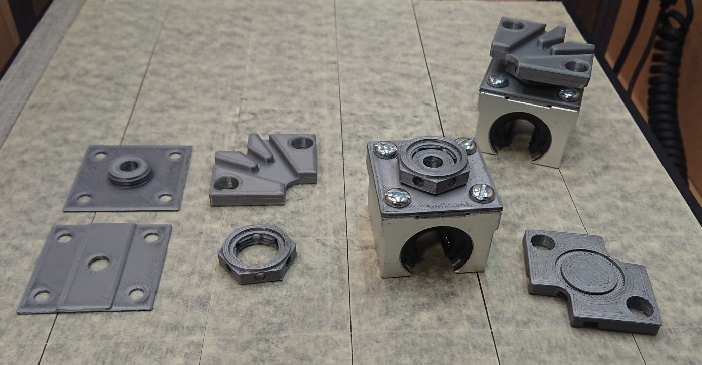

# Adapters for linear guides for the Snapmaker 2.0
 To reduce the wobbling of the build plate I have installed linear guides that provide additional support. These adapters help to connect the guides to the buildplate.

 Especially when doing cnc tasks, the buildplate can be pushed down by the toolhead. This results in less accurate work and may reduce the quality of your work. Some people also report some instability of the platform in general. However, this can vary between different devices.

 A wonderful job was already done by [3DNate](https://www.thingiverse.com/3dnate/) with this design: https://www.thingiverse.com/thing:4860729
 The only drawback, you need to accurately measure the the height, print and make sure it fits and/or create intermediate pieces to the exact needed height. I wanted to make this adjustable so it's easier to install and use.

 Therefore a simple design was created with a nut that can be adjusted. Similar to how a lot of tables can be leveled by turning one of the feet into a higher or lower position.

 I have used an SBR-16 linear rail for my modification. If you are using another type of rail, you may need to make some adjustments.

## Why use this?
To provide extra support to the build plate.
Note, this is no replacement for tramming your machine (i.e. especially make sure both vertical axis are aligned to the horizontal plane). That still needs to be done reliably.

## Overview of elements
- **bottomwiththread**: The bottom part that is mounted to the guide that rolls over the rail.  You need 4 of these.
- **bottomfiller**: The guide has a small cutout, this fills that cutout to provide extra support.  This could have been combined with the bottomwiththread, but then you would need supports which I wanted to avoid. You need 4 of these.
- **nut**: The nut that screws onto the thread and thus pushes upwards. There are holes in the side to allow putting in a screw to fixate in a final position or put in a drup of glue. Probably not needed to fixate it that way.
- **railtopwithhole**: a remix of the design by 3Dnate to "grab" the Snapmaker carriage. You need 4 of these. It's not strictly necessary, but if you want to make sure the holes are aligned you should mirror 2 of them. If you have a new style of bed for the snapmaker (the design has been revised) it should be possible to replace that stl to generate a fitting part for your needs.
- **wrench**: The clearance between the bed & adapter is rather small which means most standard wrenches (or fingers for that matter :) ) won't fit between. this thin wrench does.

Where possible all objects are parameterized so they can easily be adjusted.
Holes are foreseen so the set screws to adjust the guides are accessible.

## What to watch out for when using this
- These are not a replacement for tramming your machine 

## How to print
Make sure to print the threads with a high quality setting. I have had great success with a variable layer height in Prusaslicer to get a good balance between speed and quality. (threaded parts with a layer height of 0.08 to 0.12, other parts of the print with a layer height of 0.30).

After printing and putting the nut on the thread, don't force it. The tolerance is low, if you feel too much resistance, unscrew a bit, tighten again just a bit further, unscrew etc.  Repeat that until it fits perfectly and you can easily tighten and loosen the nut.

## Result
In action: https://youtu.be/2wn5efR2PGg

printed result: 

## Other
There are some alternative approaches in the OpenScad file using more of a type jack wrench approach, however, there was too little clearance between the rail and buildplate to make this work. Those are still in the code, but lack a bit of documentation.  The relevant code for the third and final iteration is at the bottom of the file. (look for "third and final iteration")

To generate the threaded parts, I've made use of the excellent [threadlib](https://github.com/adrianschlatter/threadlib) library, put that in a "threadlib" folder in the source directory to build the project.

This thing is also published on Thingiverse: https://www.thingiverse.com/thing:4935804

The version for the new bed has not been tested. As it is 3mm thicker, it might not fit. I'm assuming it actually slides deeper into the bed, but this is to be confirmed by someone who actually has the new bed.